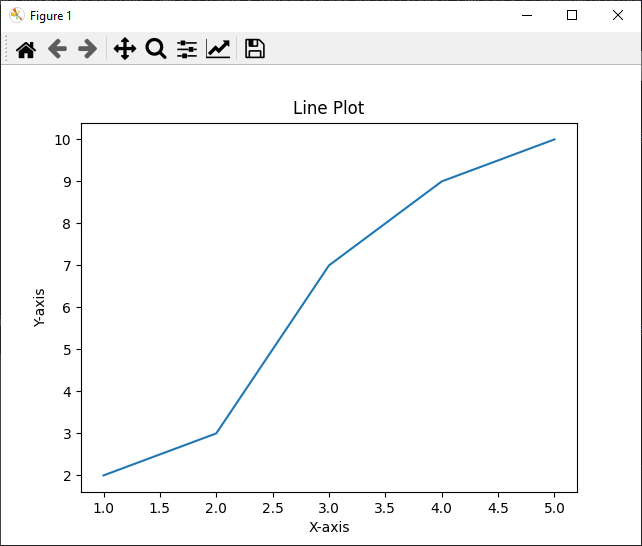
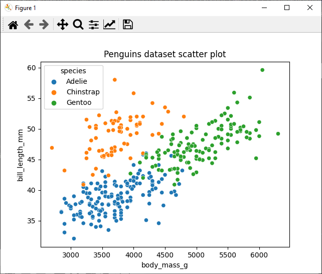

# Chapter 3: Python Libraries for Data Science

As you explore further into data science, you'll quickly discover that Python's true power lies in its extensive ecosystem of libraries and tools specifically designed for data science tasks. In this chapter, we will introduce you to the most commonly used Python libraries that form the backbone of data science projects, allowing you to streamline your work and improve efficiency.

We will provide an overview of essential libraries, such as NumPy for numerical computing, `pandas` for data manipulation, and `matplotlib` and `seaborn` for data visualization. Additionally, we will explore `scikit-learn`, a powerful library for machine learning, and TensorFlow, a popular library for deep learning. 

In the first part of this chapter, we'll present code snippets using these libraries to pique your interest. We'll also demonstrate the results generated by running the code, emphasizing the remarkable outcomes achievable with only a few lines. If you're uncertain about the details, don't fret&mdash;subsequent chapters will thoroughly explain the use of these libraries.

In the remainder of this chapter, we will discuss each library's main purpose, highlighting the key functionalities that make it a valuable addition to your data science toolkit. By the end of this chapter, you will have a solid understanding of the most popular Python libraries used in the data science field, and you will be well-equipped to select the appropriate tools for your projects.

Our learning goals for this chapter are:

 * Gain familiarity with the most commonly used Python libraries for data science
 * Understand the main purposes and functionalities of NumPy, `pandas`, `matplotlib`, `seaborn`, `scikit-learn`, and TensorFlow
 * Learn how these libraries can be leveraged to streamline your data science projects and improve efficiency

## 3.1: Overview of essential libraries

Data science encompasses various tasks, such as data manipulation, data cleaning, data visualization, machine learning, and more. Python offers an extensive ecosystem of libraries to simplify these tasks, making it an ideal language for data science. We will provide an overview of the essential libraries commonly used in data science projects.

### NumPy (Numerical Python)

NumPy is a foundational library for numerical computing in Python. It provides support for arrays, matrices, and mathematical functions to operate on them. Its primary data structure, the NumPy array, is more efficient than Python lists for numerical operations. This is partly because all elements must be of the same type, which is not a requirement for lists.

Key features of NumPy include:

 * Efficient array operations
 * Broadcasting for element-wise operations
 * Mathematical functions (linear algebra, Fourier analysis, etc.)
 * Random number generation

Here's an example of how to create a NumPy array from a Python list, and then perform an operation on all the elements in turn in a single operation:

```python
import numpy as np

# Create a NumPy array
arr = np.array([1, 2, 3, 4, 5])

# Perform element-wise addition
result = arr + 5
print(result)
```

This will output:

```plaintext
[ 6  7  8  9 10]
```

### `pandas` (Panel Data)

`pandas` is a powerful library for data manipulation and analysis built on top of NumPy. It introduces two main data structures, DataFrame and Series, which are designed to handle and analyze data stored as tabular and one-dimensional data, respectively. `pandas` is great for working with structured data, like spreadsheets and tables.

Key features of `pandas` include:

 * Data handling: loading, saving, and cleaning
 * Data manipulation: reshaping, merging, and grouping
 * Handling missing values
 * Time series functionality

Here's an example of how to create a `pandas` DataFrame from a Python dictionary, with Python lists as the dictionary values. The DataFrame is then filtered by age and then output:

```python
import pandas as pd

# Create a DataFrame
data = {'Name': ['Alice', 'Bob', 'Charlie'],
        'Age': [25, 30, 35]}
df = pd.DataFrame(data)

# Filter DataFrame by age
filtered_df = df[df['Age'] > 25]
print(filtered_df)
```

This will output:

```plaintext
      Name  Age
1      Bob   30
2  Charlie   35
```

### `matplotlib`

`matplotlib` is a popular library for creating static, interactive, and animated data visualizations in Python. It provides a wide range of plots, such as line plots, scatter plots, and bar plots.

Key features of `matplotlib` include:

 * Customizable plots
 * 2D and 3D plotting
 * Integration with `pandas`
 * Ability to save plots in various formats

Here's an example of how to create a simple line plot from two Python lists, and then display it in a window on your Desktop (shown here is Python and `matplotlib` using `pyqt5` under Windows 10):

```python
import matplotlib.pyplot as plt

# Create a simple line plot
x = [1, 2, 3, 4, 5]
y = [2, 3, 7, 9, 10]

plt.plot(x, y)
plt.xlabel('X-axis')
plt.ylabel('Y-axis')
plt.title('Line Plot')
plt.show()
```



Should opening a new desktop window not be desired (or possible), the line `plt.show()` can be replaced with either `plt.savefig('filename.png')` (to save as a bitmap PNG graphic) or `plt.savefig('filename.svg')` (to save as a vector SVG).

### `seaborn`

`seaborn` is a data visualization library built on top of `matplotlib`. It offers a high-level interface for drawing attractive and informative statistical graphics. `seaborn` provides several built-in themes and color palettes to make it easy to create aesthetically pleasing visualizations.

Key features of `seaborn` include:

 * High-level interface for statistical graphics
 * Various built-in themes and color palettes
 * Advanced visualization types (e.g., violin plots, box plots, etc.)
 * Integration with `pandas` and `matplotlib`

Here's and example scatterplot with `seaborn` using one of the built-in datasets:

```python
import seaborn as sns
import matplotlib.pyplot as plt

# Load the built-in 'penguins' dataset
penguins = sns.load_dataset('penguins')

# Create a scatter plot
sns.scatterplot(data=penguins, x='body_mass_g', y='bill_length_mm', hue='species')

# Add a title
plt.title('Penguins dataset scatter plot')

# Display the plot
plt.show()
```



### `scikit-learn`

`scikit-learn` is a versatile machine learning library for Python. It provides simple and efficient tools for data mining and data analysis, including classification, regression, clustering, and dimensionality reduction. It also provides various utilities for data preprocessing, model evaluation, and hyperparameter tuning.

Key features of `scikit-learn` include:

 * Supervised and unsupervised learning algorithms
 * Model selection and evaluation
 * Feature extraction and preprocessing
 * Integration with NumPy, `pandas`, and `matplotlib`

Example:

```python
from sklearn.datasets import load_iris
from sklearn.model_selection import train_test_split
from sklearn.tree import DecisionTreeClassifier
from sklearn.metrics import accuracy_score

# Load the iris dataset
iris = load_iris()
X = iris.data
y = iris.target

# Split the data into training and testing sets
X_train, X_test, y_train, y_test = train_test_split(X, y, test_size=0.2, random_state=42)

# Train a Decision Tree classifier
clf = DecisionTreeClassifier()
clf.fit(X_train, y_train)

# Make predictions and evaluate the model
y_pred = clf.predict(X_test)
accuracy = accuracy_score(y_test, y_pred)
print(f"Accuracy: {accuracy:.2f}")
```

This will output:

```plaintext
Accuracy: 1.00
```

### TensorFlow

TensorFlow is an open-source library for machine learning and artificial intelligence, developed by Google. It is particularly useful for deep learning, as it allows for efficient computation on both CPUs and GPUs. TensorFlow's flexible architecture enables deploying computation to multiple platforms with a single API.
Key features:

 * Efficient computation on CPUs and GPUs
 * Flexible and modular architecture
 * Support for deep learning and neural networks
 * Integration with Keras, a high-level neural networks API

Here's a simple example of creating a neural network with TensorFlow and Keras, using the same iris dataset:

```python
import tensorflow as tf
from tensorflow.keras.models import Sequential
from tensorflow.keras.layers import Dense
from sklearn.preprocessing import StandardScaler
from sklearn.datasets import load_iris
from sklearn.model_selection import train_test_split

# Load the dataset
iris = load_iris()

# Prepare the data
X_train, X_test, y_train, y_test = train_test_split(iris.data, iris.target, test_size=0.2, random_state=42)
scaler = StandardScaler().fit(X_train)
X_train_scaled = scaler.transform(X_train)
X_test_scaled = scaler.transform(X_test)

# Create a neural network
model = Sequential()
model.add(Dense(8, activation='relu', input_shape=(4,)))
model.add(Dense(3, activation='softmax'))

# Compile the model
model.compile(optimizer='adam', loss='sparse_categorical_crossentropy', metrics=['accuracy'])

# Train the model
model.fit(X_train_scaled, y_train, epochs=50, batch_size=10)

# Evaluate the model
loss, accuracy = model.evaluate(X_test_scaled, y_test)
print(f"Accuracy: {accuracy:.2f}")
```

This will output:

```plaintext
[many lines above...]
Accuracy: 0.97
```

These essential libraries provide a solid foundation for any data science project in Python. By mastering their usage, you will have access to powerful tools for data manipulation, analysis, visualization, and machine learning. As you progress through the book, we will delve deeper into each of these libraries, learning how to use them effectively for various data science tasks.

The rest of this chapter covers the installation process for each of these libraries, and provides further insight into their backgrounds and applications. Keep in mind that installing some of these libraries may require significant download bandwidth (potentially hundreds of megabytes), but you only need to complete the installation process once for each environment you set up (see chapter 2 for details of this).

## 3.2: NumPy

NumPy, short for Numerical Python, is an open-source library that was created by Travis Oliphant in 2006. It emerged as a result of the need for a more efficient and convenient array processing package in Python. Before NumPy, Python had limited support for numerical computing, and it relied on Numeric and Numarray, two separate numerical libraries that had overlapping functionalities but were not fully compatible with each other.

Travis Oliphant, a scientist with a background in numerical computing, decided to create a new library that combined the best features of Numeric and Numarray while addressing their limitations. He designed NumPy to be fast, easy to use, and flexible, enabling it to become the foundation for many other scientific computing libraries in Python.

Uses of NumPy include:

 1. Efficient array operations: NumPy provides the ndarray (N-dimensional array) data structure, which is a more efficient and convenient alternative to Python lists for numerical operations. This enables faster computations and reduces the memory footprint.

 2. Broadcasting: NumPy allows for broadcasting, which is a mechanism to perform element-wise operations on arrays of different shapes and sizes, without the need for explicit loops or reshaping.

 3. Mathematical functions: NumPy offers a rich set of mathematical functions, including basic arithmetic operations, linear algebra, statistical functions, and more. These functions are designed to work seamlessly with NumPy arrays and are optimized for performance.

 4. Random number generation: NumPy provides functions for generating random numbers from various probability distributions, which is useful in simulations, statistical analyses, and machine learning.

 5. Interoperability: NumPy serves as a foundation for many other scientific libraries in Python, such as `pandas`, `matplotlib`, and `scikit-learn`. These libraries build upon NumPy's functionality and data structures, making it easier to work with data across different domains.

NumPy can be installed using `pip` with the following command, in your terminal or command prompt:

```bash
pip install numpy
```

### Creating NumPy arrays

NumPy arrays are the primary data structure in the library and are more efficient than Python lists when it comes to numerical operations. You can create NumPy arrays from lists, tuples, or by using built-in functions.

```python
import numpy as np

# Creating NumPy arrays from lists
list_array = np.array([1, 2, 3, 4, 5])
print("Array from a list:", list_array)

# Creating NumPy arrays from tuples
tuple_array = np.array((6, 7, 8, 9, 10))
print("Array from a tuple:", tuple_array)

# Creating NumPy arrays using built-in functions
zeros_array = np.zeros(5)
print("Array of zeros:", zeros_array)

ones_array = np.ones(5)
print("Array of ones:", ones_array)

range_array = np.arange(1, 11, 2)
print("Array with a range of values:", range_array)
```

### Array operations

NumPy supports element-wise and matrix operations on arrays. These operations are fast and efficient, thanks to the underlying C and Fortran implementations.

```python
A = np.array([1, 2, 3])
B = np.array([4, 5, 6])

# Element-wise addition
C = A + B
print("Element-wise addition:", C)

# Element-wise subtraction
D = A - B
print("Element-wise subtraction:", D)

# Element-wise multiplication
E = A * B
print("Element-wise multiplication:", E)

# Element-wise division
F = A / B
print("Element-wise division:", F)

# Matrix multiplication
G = np.dot(A, B)
print("Matrix multiplication:", G)
```

### Array indexing and slicing

Indexing and slicing NumPy arrays is similar to Python lists. However, multi-dimensional arrays allow for more complex indexing and slicing operations.

```python
# Create a 1D array
array_1d = np.array([1, 2, 3, 4, 5])

# Indexing a 1D array
print("First element:", array_1d[0])
print("Last element:", array_1d[-1])

# Slicing a 1D array
print("First three elements:", array_1d[:3])
print("Last two elements:", array_1d[-2:])

# Create a 2D array
array_2d = np.array([[1, 2, 3], [4, 5, 6], [7, 8, 9]])

# Indexing a 2D array
print("Element at position (1,2):", array_2d[1, 2])

# Slicing a 2D array
print("First two rows:\n", array_2d[:2, :])
print("Last column:\n", array_2d[:, -1])
```

### Array reshaping and manipulation

Reshaping arrays is a common operation in NumPy, and it can be performed using the reshape function. Other array manipulation functions include concatenate, vstack, and hstack.

```python
# Create a 1D array
array_1d = np.array([1, 2, 3, 4, 5, 6, 7, 8, 9])

# Reshape the 1D array into a 3x3 2D array
array_2d = array_1d.reshape(3, 3)
print("Reshaped 2D array:\n", array_2d)

# Flatten the 2D array back into a 1D array
array_flattened = array_2d.flatten()
print("Flattened 1D array:", array_flattened)

# Concatenate two arrays
A = np.array([1, 2, 3])
B = np.array([4, 5, 6])
C = np.concatenate((A, B))
print("Concatenated array:", C)

# Stack arrays vertically
D = np.vstack((A, B))
print("Vertical stack:\n", D)

# Stack arrays horizontally
E = np.hstack((A, B))
print("Horizontal stack:", E)
```

### Array broadcasting

Broadcasting is a powerful NumPy feature that allows you to perform arithmetic operations on arrays of different shapes without the need for explicit looping or reshaping.

```python
A = np.array([[1, 2, 3], [4, 5, 6], [7, 8, 9]])
B = np.array([1, 2, 3])

# Add B to each row of A
C = A + B
print("Broadcasted addition:\n", C)

# Multiply each row of A by B
D = A * B
print("Broadcasted multiplication:\n", D)
```

### Statistical functions

NumPy provides various statistical functions to perform calculations on arrays, such as mean, median, standard deviation, and correlation coefficient.

```python
import numpy as np

data = np.array([1, 2, 3, 4, 5, 6, 7, 8, 9])

# Calculate the mean
mean = np.mean(data)
print("Mean:", mean)

# Calculate the median
median = np.median(data)
print("Median:", median)

# Calculate the standard deviation
std_dev = np.std(data)
print("Standard deviation:", std_dev)

# Calculate the correlation coefficient
data_1 = np.array([1, 2, 3, 4, 5])
data_2 = np.array([2, 4, 6, 8, 10])
corr_coef = np.corrcoef(data_1, data_2)
print("Correlation coefficient:\n", corr_coef)
```

In summary, we have covered the fundamentals of NumPy, including creating and manipulating arrays, performing arithmetic operations, broadcasting, indexing and slicing, and using statistical functions. As you continue your data science journey, you'll find that a strong understanding of NumPy will be invaluable for working with more complex tasks and tools.

## 3.3: `pandas`

The `pandas` library, also known as "Python Data Analysis Library", was created by Wes McKinney in 2008. At that time, Wes was working as a quantitative analyst and was using Python for data analysis. He faced limitations with the existing tools in Python, particularly when it came to handling data in tabular formats and performing data manipulation tasks efficiently. As a result, he started developing pandas to fill this gap and provide a high-performance, easy-to-use data analysis tool for Python.

`pandas` was heavily influenced by the data structures and functionalities available in the R programming language, specifically R's `data.frame` object. Wes aimed to bring the flexibility and power of R's data manipulation capabilities to Python. The first public release of pandas was in 2010, and since then, it has gained widespread adoption and become one of the most popular libraries for data analysis in Python.

Uses of `pandas` include:

 1. Data structures: `pandas` introduces two main data structures: the Series, which represents a one-dimensional labeled array, and the DataFrame, which represents a two-dimensional labeled array (similar to a table). These data structures are built on top of NumPy arrays and provide additional functionality for handling and manipulating data.

 2. Handling missing data: `pandas` provides tools for working with missing data, such as detecting, filling, or dropping missing values. This makes it easier to clean and preprocess data for further analysis.

 3. Data manipulation: `pandas` offers a wide range of data manipulation functions, including filtering, sorting, grouping, merging, pivoting, and reshaping. This allows you to easily manipulate and transform data to fit your needs.

 4. Reading and writing data: `pandas` supports reading and writing data in various formats, such as CSV, Excel and JSON. This makes it easy to import and export data between different sources.

 5. Time series analysis: `pandas` has built-in support for handling time-stamped data and provides functions for resampling, rolling calculations, and time-based indexing.

`pandas` can be installed using `pip` with the following command, in your terminal or command prompt:

```bash
pip install pandas
```

In summary, `pandas` is an indispensable library for data science, providing a wide range of functionalities for handling and analyzing data in an efficient and intuitive manner. By mastering `pandas`, you will significantly improve your ability to manipulate, clean, and analyze data in your data science projects. We will take a more detailed look at how to utilize `pandas` in chapters 4 and 8.

## 3.4: `matplotlib`

The `matplotlib` library was created by John D. Hunter in 2003 as a way to replicate MATLAB's plotting capabilities in Python. At the time, Python lacked a robust and versatile plotting library, so John developed `matplotlib` to fill this gap.

John Hunter was a neurobiologist and was using MATLAB for his data analysis and visualization needs. However, he was drawn to Python because of its open-source nature and versatility. To facilitate his transition from MATLAB to Python, he aimed to create a library that would provide a similar plotting experience. As a result, `matplotlib` has a MATLAB-like interface, which made it easy for users familiar with MATLAB to adopt Python for their visualization needs. Since its initial release, `matplotlib` has grown into a comprehensive visualization library and has become an essential part of the Python data science ecosystem.

Uses of `matplotlib` include:

 1. Plotting: `matplotlib` supports a wide range of plotting types, such as line plots, scatter plots, bar plots, histograms, 3D plots, and more. This allows users to create visualizations tailored to their specific data and analysis needs.

 2. Customization: `matplotlib` offers extensive customization options, enabling users to fine-tune the appearance of their plots. You can modify plot elements such as colors, markers, line styles, axis labels, legends, and annotations, among others.

 3. Integration with other libraries: `matplotlib` can be used in conjunction with other Python libraries, such as NumPy and `pandas`, to visualize data stored in various data structures. Moreover, it serves as the foundation for other visualization libraries, like `seaborn`, which build upon its functionality and offer additional plotting styles and options.

 4. Interactivity: `matplotlib` supports the creation of interactive plots, which allow users to explore data by zooming, panning, or updating plot elements in response to user actions.

 5. Exporting: `matplotlib` provides the ability to export plots in various file formats, such as PNG, JPEG, SVG, and PDF. This makes it easy to integrate visualizations into reports, presentations, and publications.

`matplotlib` can be installed using `pip` with the following command, in your terminal or command prompt:

```bash
pip install matplotlib
```

By mastering these fundamentals of `matplotlib`, you can create a wide range of visualizations to better understand and communicate your data. As you continue your data science journey, you will find `matplotlib` to be an invaluable tool for exploring and presenting your findings. We will go into more detail about using `matplotlib` in chapters 6 and 9.

## 3.5: `seaborn`

The `seaborn` library is a Python data visualization library based on `matplotlib`. It was created by Michael Waskom in 2012 to provide a high-level interface for creating visually appealing, informative, and statistical graphics. seaborn was designed to make it easy to produce plots that are both aesthetically pleasing and effective in communicating insights from data.

Michael Waskom, a neuroscientist, created `seaborn` to address some of the limitations and complexities he encountered while using `matplotlib`. While `matplotlib` is powerful and versatile, it can be challenging to create certain types of plots or achieve a polished visual style without writing extensive customization code. seaborn simplifies this process by providing a set of predefined themes and color palettes, as well as built-in functions for creating complex visualizations with minimal effort.

Uses of `seaborn` include:

 1. Statistical graphics: `seaborn` focuses on providing visualizations that emphasize the underlying statistical properties of the data. It includes functions for creating scatter plots, line plots, bar plots, histograms, box plots, violin plots, and more, with built-in support for visualizing data distributions, trends, and relationships.

 2. Aesthetics: `seaborn` offers a variety of themes and color palettes to make plots more visually appealing and easier to interpret. These themes are designed to be consistent and coherent, ensuring that visualizations have a polished and professional appearance.

 3. Faceting: `seaborn` makes it easy to create faceted plots, which are a collection of smaller plots that display subsets of the data across different variables. Faceting allows for the comparison of different groups or conditions within a single visualization.

 4. Integration with `pandas`: `seaborn` works seamlessly with `pandas`, enabling users to directly pass DataFrames to its plotting functions. This integration simplifies the process of visualizing data stored in `pandas` data structures.

 5. Extending `matplotlib`: `seaborn` is built on top of `matplotlib`, so users can still access and customize `matplotlib`'s underlying functionality when needed. This allows for further customization and control over the appearance and behavior of seaborn plots.

`seaborn` can be installed using `pip` with the following command, in your terminal or command prompt:

```bash
pip install seaborn
```

Overall, the Python `seaborn` library is an excellent data visualization tool that is relatively easy to use, even for novice Python programmers. We will go into more detail about `seaborn` in chapters 6 and 9.

## 3.6: scikit-learn

The `scikit-learn` library is a popular open-source Python library for machine learning and data analysis. It was initially developed in 2007 by David Cournapeau as a Google Summer of Code project. Later, in 2010, the project was taken over by Fabian Pedregosa, Gaël Varoquaux, Alexandre Gramfort, and Vincent Michel, who were researchers at the French Institute for Research in Computer Science and Automation (INRIA). The library is built on top of NumPy, SciPy, and `matplotlib`, leveraging their capabilities to provide a comprehensive and user-friendly toolkit for machine learning.

The name "scikit" comes from the term "SciPy Toolkit," and "learn" refers to its focus on machine learning. The library was designed to be easy to use and accessible, with a consistent and straightforward API that enables users to quickly implement and experiment with various machine learning algorithms.

The `scikit-learn` library provides a wide range of algorithms for classification, regression, clustering, and dimensionality reduction, as well as tools for data preprocessing, model evaluation, and hyperparameter tuning. With its simple API and extensive documentation, `scikit-learn` is an excellent choice for both beginners and experts in machine learning.

Uses of `scikit-learn` include:

 1. Supervised learning: `scikit-learn` provides a wide range of supervised learning algorithms, including linear and logistic regression, support vector machines, k-nearest neighbors, decision trees, random forests, and gradient boosting. These algorithms can be used for tasks such as classification, regression, and feature selection.

 2. Unsupervised learning: `scikit-learn` also offers unsupervised learning algorithms for tasks like clustering, dimensionality reduction, and outlier detection. Some popular unsupervised learning algorithms available in `scikit-learn` are k-means, hierarchical clustering, PCA, and t-SNE.

 3. Model evaluation and selection: `scikit-learn` includes tools for evaluating model performance, such as cross-validation, train-test splits, and various evaluation metrics like accuracy, precision, recall, F1-score, and mean squared error. These tools help users assess the quality of their models and choose the best one for their problem.

 4. Preprocessing: `scikit-learn` provides a range of preprocessing functions for cleaning and transforming data, including scaling, normalization, encoding categorical variables, and handling missing values. These functions are essential for preparing data for machine learning algorithms.

 5. Feature engineering and selection: `scikit-learn` offers tools for feature engineering, such as polynomial feature generation and custom transformers, as well as feature selection methods like recursive feature elimination and model-based selection.

 5. Pipelines: `scikit-learn` supports the creation of pipelines that streamline the process of applying multiple preprocessing steps and machine learning algorithms in a consistent and reproducible manner.

`scikit-learn` can be installed using `pip` with the following command, in your terminal or command prompt:

```bash
pip install scikit-learn
```

(When importing this library, remember that the top-level module itself is called `sklearn`.)

In summary, `scikit-learn` is a powerful and user-friendly library for machine learning in Python. It offers a wide range of algorithms, as well as tools for data preprocessing, model evaluation, and hyperparameter tuning. By mastering `scikit-learn`, you will be well-equipped to tackle a variety of data science tasks and build high-quality machine learning models. We will meet this library again in chapters 10, 11 and 12.

## 3.7: TensorFlow

TensorFlow is an open-source machine learning and deep learning library developed by the Google Brain team. It was released in November 2015 under the Apache 2.0 license. TensorFlow was originally created to meet the internal requirements of Google for large-scale machine learning and deep learning applications, such as speech recognition, image classification, and natural language processing.

The name "TensorFlow" comes from the core concept of tensors, which are multi-dimensional arrays of data, and the flow of these tensors through computational graphs representing complex operations. TensorFlow was designed to be highly flexible and efficient, enabling users to develop and deploy machine learning models on various platforms, from mobile devices to high-performance computing clusters.

Uses of TensorFlow include:

 1. Deep learning: TensorFlow is primarily known for its support of deep learning, a subfield of machine learning that focuses on artificial neural networks with many layers. TensorFlow provides built-in functionality for creating and training various types of neural networks, such as convolutional neural networks (CNNs), recurrent neural networks (RNNs), and transformers.

 2. Customizable architecture: TensorFlow's flexible architecture allows users to create custom layers, loss functions, and optimizers, enabling the development of highly specialized models tailored to specific problems.

 3. Distributed computing: TensorFlow is designed to scale across multiple devices and computing clusters, facilitating the efficient training of large models and the processing of large datasets.

 4. Model deployment: TensorFlow supports various deployment options, including on mobile and edge devices, web applications, and server environments. This flexibility allows developers to integrate machine learning models into a wide range of applications and platforms.

 5. TensorFlow Extended (TFX): TensorFlow offers a comprehensive ecosystem of tools for end-to-end machine learning workflows, including data validation, preprocessing, model training, and serving.

 6. Integration with other libraries: TensorFlow can be used in conjunction with other popular libraries, such as Keras (a high-level neural networks API) and TensorFlow Probability (a library for probabilistic modeling and inference).

 7. Visualization and debugging: TensorFlow provides TensorBoard, a web-based tool for visualizing and debugging machine learning models. TensorBoard allows users to monitor training progress, compare different runs, and visualize model architectures and data.

TensorFlow can be installed using `pip` with the following command, in your terminal or command prompt:

```bash
pip install tensorflow
```

This will install the latest stable version of TensorFlow, which includes support for Keras, the user-friendly API for building deep learning models.

In summary, we have introduced TensorFlow, a powerful library for deep learning, and showed you how to create different types of neural networks, such as feedforward neural networks, CNNs, and RNNs. TensorFlow provides a flexible and efficient platform for building, training, and deploying machine learning models, making it an essential tool for any data scientist working with deep learning. We will revisit TensorFlow and explore its capabilities in chapter 13.

## 3.8: Other Python Libraries

There are a number of other libraries needed to run the code examples from later in this book. They can all be installed from the terminal or command prompt using `pip`, as for the libraries introduced previously in this chapter. The full list of extra libraries is:

 * `pyqt5`: Allow `matplotlib` to open a window in your Desktop when using the `show()` function
 * `openpyxl`: Allow `pandas` to read/write Microsoft Excel format spreadsheets
 * `pingouin`: Provides facilities related to correlation analysis 
 * `plotly`: The Plotly library allows for creation of interactive web-based visualizations
 * `bokeh`: The Bokeh library is an alternative to Plotly which doesn't create need a web-server/client
 * `geopandas`: Geopandas extends the capabilities of `pandas` to handle geospatial data
 * `folium`: The Folium library allows easy creation of web-based interactive maps
 * `scikit-optimize`: This library provides Bayesian optimization capabilities
 * `statsmodels`: This library is used for time series decomposition
 * `nltk`: This library provides Natural Language Processing (NLP) functionality
 * `spacy`: This is another NLP library
 * `gensim`: This library can be used for Topic Modeling of natural language data
 * `requests`: The Requests library provides a way of downloading web-content
 * `beautifulsoup4`: The BeautifulSoup library simplifies extraction of meaningful data from HTML files
 * `scrapy`: The Scrapy also allows for processing raw HTML
 * `retry`: This library attempts to work around rate limits of some public APIs

The commands below can be used to install these extra libraries as needed:

```bash
pip install pyqt5     # Under Linux, it may be necessary to install additional package(s)
pip install openpyxl
pip install pingouin
pip install plotly
pip install bokeh
pip install geopandas
pip install folium
pip install scikit-optimize
pip install statsmodels
pip install nltk
pip install spacy
pip install gensim
pip install requests
pip install beautifulsoup4
pip install scrapy
pip install retry
```

Finally, here is how to install all of the libraries we met earlier in this chapter as a single `pip` invocation:

```bash
pip install numpy pandas matplotlib seaborn scikit-learn tensorflow
```
